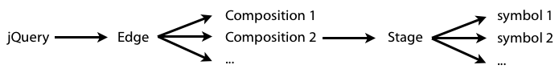
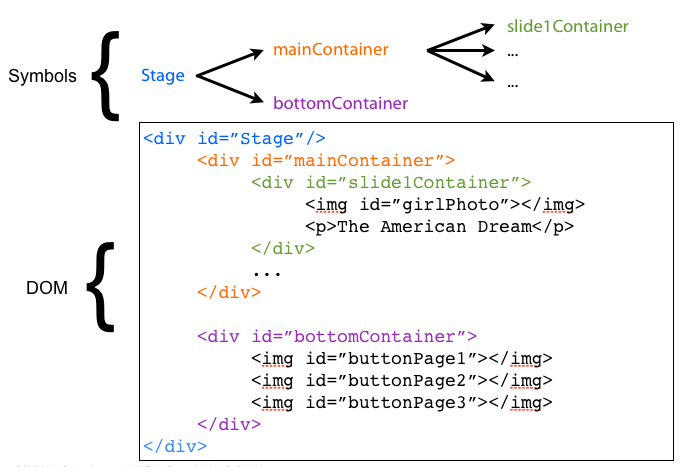

# EDGE ANIMATE FOR WEB DEVELOPERS

At its core, *Edge Animate* is a tool which lets you animate DOM elements in visual way. The resulting animations, called *compositions*, can be published in any context capable of displaying modern web content, whether it's a web page, or, say, the Web View control of a native mobile app.

An Edge composition is typically displayed in a `
` of an HTML page. An HTML page can hold several compositions -- even though the tool can only edit one composition at a time.

The tool also lets you edit a whole pre-existing HTML page. In that case, the page itself is the composition, and each animated element will be added a single CSS class (edgeLoad-XXXXX). But the overall idea is pretty much the same in both cases.

By default, DOM elements created within the tool will be injected at runtime (ie in the HTML page source file, the stage `
` is empty). You can also choose to publish it as static content for better SEO.

Compositions manipulate DOM elements using a javascript framework called the *Edge runtime*, which has several dependencies, including jQuery.

--------------------------
##File structure of an Edge Animate project

Here's a short description of each file involved (assuming your page was named *index*).

* *index.edge* is a JSON file used by the authoring tool to open the project (not to be published).
* *index.html* is the host HTML file
* *index_edgePreload.js* is the yepnope based loader which loads everything else.
* *index_edge.js* describes the composition content (assets, symbols, timelines)
* *index_edgeActions.js* holds the custom javascript code added by the user
* *images* (folder) contains all images used by the tool
* *edge_includes* (folder) contains all required libraries:
	*  JSON2: a library for working with the JSON format
	*  jQuery
	*  jQuery easing: a jQuery plugin describing easing functions for animations
	*  Edge: the core Edge Animate library describing all JavaScript objects and classes used by an animation

Let's take a deeper look at the latter and what it creates exactly.

--------------------------
##Main Javascript architecture

The role of compositions is to animate visual elements like text and images through their corresponding DOM element. If using javascript, you can typically manipulate those DOM elements using jQuery and, optionally, some of its plugins.

Rather than being an alternative to this method, the Edge animate library augments it in several ways, by describing a framework to make it easier to work with animations.

At the very top level of a page containing Edge Animate compositions, attached to jQuery, is one unique global `Edge` object, which knows about all compositions in the page.

Each `composition` object has exactly one `Stage` object, which can be considered as the root of the scene graph (the equivalent of `root` in flash animations).

`jQuery -> Edge -(1-n)-> Composition -> Stage -(1-n)-> child symbols`

The stage has a timeline using which lets you define animations of its child elements over time. That is because the stage is a particular kind of object named `symbol`.

--------------------------

##Symbols vs. DOM elements

`Symbols` are objects which have a timleline using which you can animate its child elements. To manipulate this timeline, `symbols` have an API with methods such as `play()` and `stop()`.

`Symbols` are reusable, so we need to distinguish between the `symbol definition` --which you can find in the Library panel-- and a `symbol instance` -- which you place on the stage and is actually used in the DOM.

For those of view coming from a Flash background, this will probably remind you of the notion of a `MovieClip`.

However, **a symbol instance is not to be confused with its corresponding DOM element**. It is not a visual object. A symbol instance can access its underlying DOM elements (usually through a jQuery handle), but those are different objects altogether.

`Symbols` can have child symbols, but again, those children are other symbol instances, not DOM elements.

`symbol -(1-n)-> child symbols -(1-n)-> child symbols (…)`

The DOM element tree is a parralel but separated hierarchical tree.

`div -(1-n)-> child elements -(1-n)-> child elements (…)`

> Note: The stage itself is a `symbol`, which is why it has timeline. However, it cannot be reused (you don't see it in the Library panel).

As a reminder, all Symbol definitions, DOM Elements descriptions, timeline content are all described in the  `index_edge.js` file. You could edit this file manually to modify the content of a composition, however you should be careful in doing so because it might break the ability of the tool to reopen and modify the composition. The best advice is to stay as close as possible to the syntax originally generated, including comments.

--------------------------

##Actions scope

Edge Animate users create code snippets called *Actions* to be executed in response to some events. Events can be dispacthed by an DOM element (e.g. `click`), a symbol (e.g. `creationComplete`). Some events are dispatched by the timeline when the playhead hits a certain point. Those events are called *Triggers*.

Within those *actions*, users should use `sym` to  access the instance of the currently open *symbol definition*. By default, it is the *Stage*, so when you create a timeline trigger, `sym` is the Stage. If you select an element on the Stage and select "Open Actions" for it, `sym` is still the *Stage*, not the selected element.

> In the main code editor (the one you open with `Ctrl/Cmd+E`), just look at the code navigator on the left: `sym` corresponds to the folder in which the selected item is located.

Consider a composition open on the stage (which is the default), in which there is a simple Text animated from left to right. We want users to click on an element named `greenButton` to replay the composition. We select the `greenButton`, and select *Open Actions > click* to open the code editor. In the code displayed, `sym` is the stage, not the button on which users will click to trigger the code.

	sym.play();

To target a the timeline of a child symbol, you'd use `sym.getSymbol("name");`, which returns a child symbol instance from its name.

Say that on our composition stage, we have an symbol instance named `square`, which  timeline contains a small animation. To play that square animation when clicking a button on the stage, select that button `click` event and type:
	
	var square = sym.getSymbol("square");
	square.play();

Now what if what you want to access is not a simple but the DOM element of a symbol? Then you just use `sym.$("name")` which returns the jQuery handle of a child element from the name.

So, in our previous composition, if we want to access the greenButton (which is a div) and make it disappear, we just write:

	var greenButton = sym.$("greenButton");
	greenButton.hide();

Note that, to get the jQuery handle corresponding to `sym` itself (in our case, the Stage div), you can simply use	`sym.getSymbolElement();`

In both cases, the `name` parameter is the one chosen in the properties panel, **not** the DOM selector. If you want to retrieve the name of the DOM selector from the edge name, you use `sym.lookupSelector(name)`.

##How Actions are implemented

Edge Animate actually inserts actions code into the `[page-name]_edgeActions.js`. It simply hides the global file structure in the tool's code editor to make it easier to edit for regular users.

This is what the generated edgeAction file will look like:

	(function($, Edge, compId){
	var Composition = Edge.Composition, Symbol = Edge.Symbol; // aliases for commonly used Edge classes

	   //Edge symbol: 'stage'
	   (function(symbolName) {
            
      	Symbol.bindElementAction(compId, symbolName, "${_greenButton}", "click", function(sym, e) {
			sym.play();
      	});
      	//Edge binding end

You can edit this file directly, either using the code editor's "full code" option, or by using an external text editor.

Here we clearly see that the `Symbol` class uses the `bindElementAction` method to have a callback (5th parameter) executed in response to an event (4th parameter) triggered by an element (3rd parameter). It is the body of this callback users will edit using the Edge Animate code editor.

The callback is passed a first parameter corresponding to the symbol instance who "owns" this action. It's also passed an `e` parameter representing the event. Using `e.target`, you can access the element which triggered the event (`greenButton`, in our example).

As you can guess, the Symbol class also have `bindTriggerAction` and `bindSymbolAction` methods, which work exactly the same way for a timeline event and a symbol event, respectively.

It is now clear that each action is declared in a separate function closure. As a consequence, you cannot create a local function or variable in a symbol action and expect to access it elsewhere. It has to belong to the corresponding symbol.

If you want a variable or function to be accessible from all actions of a given symbol, you can simply declare it at the top of the "Edge Symbol" closure:

	   //Edge symbol: 'stage'
	   (function(symbolName) {
	   
			function randomColor () {
				var c = Math.floor(Math.random()*(0xFFFFFF+1))
				return '#' + c.toString(16);
			}
		…
		
If you use the tools' editor, you can access it simply by selecting the corresponding symbol in the code editor. 

However, you don't have a reference to the symbol instance `sym`. An alternative could be to define the function as a member of this object at the moment of its creation. It turns out we have a creationComplete event we could use in that case.

Technically, only symbols can have javascript code attached to them, but this code can access and manipulate any other symbol or DOM elements, using a dedicated API.

--------------------------

##Traversing the symbol tree

We've already seen how to get a child symbol using `sym.getSymbol("name");`. We can also access an array of all child symbol instances using:

	var children = sym.getChildSymbols();

Conversly, you can go up the symbol tree to get to the parent symbol.

	sym.getParentSymbol();

To get to the root of the tree (ie the stage), you first get the composition with ` sym.getComposition()` and then call `getStage()`. You can then go down the symbol tree. This is an example of an absolute path to a symbol, which will then work from anywhere in your project:

	sym.getComposition().getStage().getSymbol("leftContainer").getSymbol("square").play(); 

Finally, note that the composition object can return the list of all instances of a given symbol definition, using `getSymbols(definitionName);`

	var allSquares = sym.getComposition().getSymbols("Square");

Now what about DOM elements? We've seen how to get a DOM element from using `sym.$("name")`, however there are times when you want to access a DOM element from another element. In that case, you simply use the jQuery API.

As a reminder, to get an array of all child DOM elements, you'd use the jQuery method `children()` on the corresponding element:

	sym.getSymbolElement().children();

You also have a `parent()` method to access the parent element, and a whole lot of other methods, but for the rest, the best is to check the [official jQuery documentation](http://docs.jquery.com/Main_Page).

##Dynamic symbol manipulation

You can of course create or delete symbols dynamically.

To create a new Symbol instance anywhere, you use:

	var instance = sym.createChildSymbol("SymbolDefinitionName", "parentSymbolInstanceName", index) ;

For some reason, an equivalent method is also available at the composition level:

	var instance = sym.getComposition().createSymbolChild("SymbolDef", "parentSym", index");

Interestingly this methods both instanciates the object and inserts the corresponding DOM element at the same time.

Also, the second parameter can be a jQuery-like selector, so that you can use things like:

	sym.createChildSymbol("SymbolDefinitionName", "body > div") ;

Using these methods, you could easily use a loop to instanciate and dynamically place symbol elements.

Likewise, you can dynamically delete symbol instances:

	sym.getSymbol("square2").deleteSymbol();

